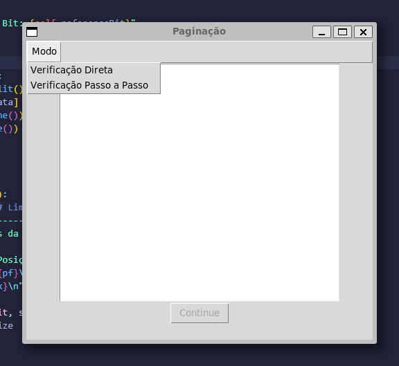
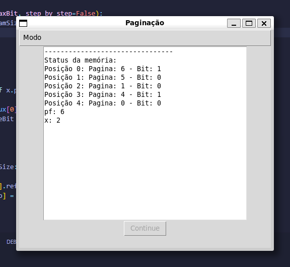
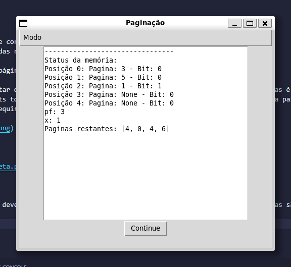
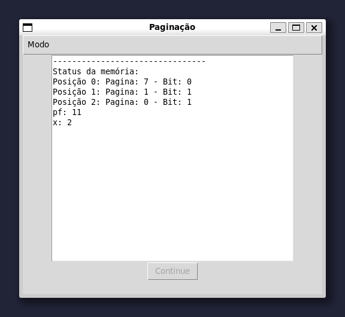
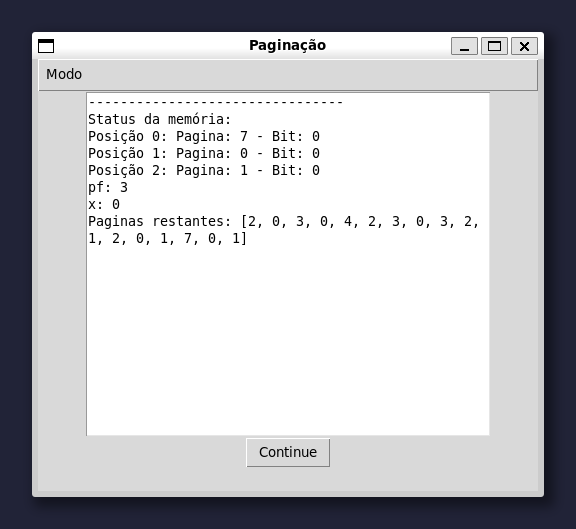

# Algoritmo Segunda Chance
Trabalho com objetivo de implementar um simulador de gerenciamento de páginas em memória que utilize o algoritmo de substituição de páginas Segunda Chance tento em vista otimizar o uso da memória, minimizando o número de faltas de página e maximizando o desempenho do sistema.

## Como executar
Para executar o programa é necessário instalar duas bibliotecas de python que são utilizadas no projeto

```bash
sudo apt-get install python3-tk
```

Para executar o programa basta executar o arquivo main.py e o arquivo de entrada

```bash
python3 main.py <arquivo_de_entrada.txt>
```

## Funcionamento do programa

O programa primeiro irá ler o arquivo que contem o seguinte padrão de informações:
 - Primeira linha: páginas a serem alocadas na memória
 - Segunda linha: tamanho da memória
 - Terceira linha: número de quadros de páginas

Após isso o programa irá começar a executar o algoritmo, o usuário terá duas opções de execução, a primeira delas é a execução direta, onde o programa lê o arquivo e mostra no estado da memória e o total de page-faults total depoi de executar toda fila de requisições. A segunda opção é a passo a passo, onde o estado da memória pode ser acompanhado por meio de um click, ao qual delimita o a requisição de uma página na memória.



Execução direta:



Execução passo a passo:

Para a execução passo a passo, o usuário deve apertar o botão para ver cada estado da memória conforme as páginas são requisitadas.



## Descrição do algoritmo

O algoritmo no código foi implementado usando um loop, enquanto ainda ouver páginas na lista de páginas lida do arquivo o algoritmo irá executar.

A primeira verificação a ser feita é se a página já esta na memória, se ela já estiver nós pegamos seu indice de forma direta e atualizamos seu bit de referencia para 1.

Se ela não estiver na memória nós percorremos a memória pelo ponteiro buscando uma página que tenha o bit de referencia igual a 0, se encontrarmos nós substituimos a página e atualizamos o bit de referencia para 1.

Enquanto não é encontrada uma página com bit de referencia igual a 0, nós atualizamos o bit de referencia para 0 da página atual que o ponteiro está apontando e incrementamos o ponteiro.

Sempre é feito uma verificação se o ponteiro chegou ao final da memória, se isso acontecer o ponteiro é resetado para o inicio da memória.

Sempre que uma página que não estava na memória é inserida é feito um incremento no contador de page-faults e a cada nova iteração é feito um incremento no contador de requisições.

Quando o contador de requisições chega no tamanho máximo é zerado todos os bits de referencia das páginas da memória.

Ao final da execução do algoritmo é mostrado o total de page-faults e o estado final da memória.

## Resultados

Na pasta ```tests``` estão alguns testes realizados, as imagens a seguir mostram a execução do arquivo ```test.txt```






